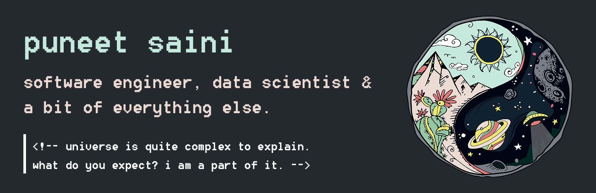

# Hi, I'm Puneet

I am a software engineer who is passionate about making open-source contributions and tinkering with data to get intruiging insights. Loves the concept of Yin-Yang. Some of the tools that I love working with include Pytorch, Prophet, Plotly, and Pandas. Side hobbies include Photo editing, graphic designing, playing ukulele, discovering new artists (singers and actors), and playing PC games.

- 😎 I’m currently taking a break from work.
- 🌱 I’m currently learning Spanish and play ukulele.
- 👯 I’m looking to collaborate on Machine learning projects.
- 💬 Ask me about Time series forecasting, Computer vision and other ML related stuff.
- 📫 How to reach me: Write to me at my Email (linked on my profile)

Connect with me on [LinkedIn](https://www.linkedin.com/in/geekpuneet/)